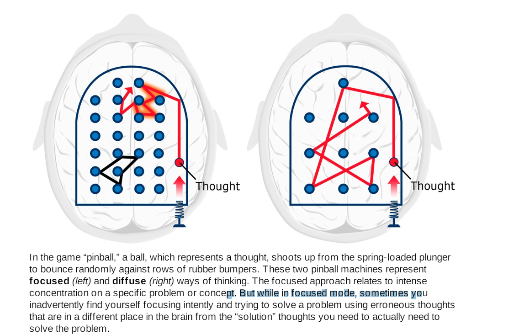

# A mind for numbers 

## How to excel at math and science

- Barbara Oakley

# The Law of Serendipity : Lady luck favours the one who tries

- Most learners use ineffective and inefficient techniques to learn
- The most commonly used stratergy is repeated learning. This is shallow and passive way of learning leading to little to no retention. It is known as "labour in vain". (The reader puts in the effort but does not go anywhere)
- We tend to use this ineffective approach as we fall victim of cognitive illusion. As we reread the content the content becomes familiar and fluent and it becomes easy for our brain to process. We mistake this ease in the process as we are learning.

# Open the door

- The author did not like math or science in his childhood and considered they are of no value to study.
- The author was intertested in languages and he registered himself in army as they would pay him to study other langugages. As the author excelled in Russian study he gained a scolorship to do bachelor's in Slavic languages in University of Washington
- The author was assigned as lieutnient in communcations in US corps where he was forced to learn how to handle telephone swithing technology. He was not doing great in the job. His coworkers where natural problem solvers that helped in the mission.
- Author reflected on his life and understood that his mind was not open to learning new things. He decided to go to college to retain his brain with the GI grant for studies
- The author struggled in the first semester and felt he was wearing blindfold in the studies when his classmates semed to have a natural knack for seeing the solutions
- The author started to catch up. He started learning the tricks about how to learn. He understood internalizing certain concepts and techniques can be powerfull. He tool lesser courses per semester then her peers even though it extended her studies.
- As things went she got better and better in this and started to enjoy studying math and science
> Our brain is designed to do extrodinary mental calculations
- Our brain does this extrodinary calculations in our everyday life, it solved complex equations and complex calculations unconsciously, unaware that we somethings already know the solution as we slowly work towards it
- While writing the book the author corresponded with hundreads of educators and professors across various disciplies and understood that these learning techniques are widely used by almost all these educators while they where learning and asking their studens to to do the same. As these things look very simple or counterintutive they felt they where not able to convey it clearly

# Easy does it : Why trying too hard can sometimes be part of the problem

> **Prime up your mental pump**
> While trying to learn a new chapter in book it helps first to take a mental picture walk of the chapter, glancing at the pictures, diagrams, headings and questions in the chapter. This is like creating neural hooks to hang your thinking on, making it easier to grasp the concepts

## Focused versus Diffuse thinking

- The brain switches between two different types of networks. - ***highly attentive*** state and more relaxed ***resting state*** networks. We call the thinking processes related to these two different types of networks the focused mode and diffuse mode.
- These 2 modes are important for learning. We frequently switch back forth between these modes throughout the day. At a time we can only be in one mode of thinking we cannot be in both the modes.
- Diffuse mode can work on things in the background that we are not actively focusing on.
- Focused mode is essential for learning math and science. It involves directly with problem solving using rational, sequential and analytical approches.
- Focues mode is associated with concentrating abilities of the prefrontal cortex.
- Diffuse mode thinking is also required for learning. 
- Diffuse mode usually provides valuable insights to the problems that we are struggling to solve.
- Diffuse mode thinking is what happens when we relax our brain and let it to wander. This allows different areas to hookup and bring up valuable insights. Like focued mode, diffuse mode is not linked to single part of the brain. It is diffused through out the brain.
- Diffuse mode insights often flow from the preliminary thinking that's been done in focues mode (***The diffuse mode must have clay to make bricks***)

## The Focuesed Mode - A tight pinball machine

- **Metaphors are powerfull tools to learn new concepts**
- Consider your brain as a pinball machine. The ball that is been relased by the spring is your thought. The rubber bumpers in the pinball machines are different neural networks across your brain. Each bump with the rubber bumper is a neural network triggering.
- In focued mode the neural network bumpers are very close to each other and diffuse mode they are fart apart.
- The close bumpers mean we can have precise thoughts. Focused mode concentrate on something that is already familir to us and the things we have a good understaning of. (**In other works focused mode triggers network in a segment that is very close the concept you already know and assume can solve this problem**)
- Focused mode tries to find paths that we already practices and experienced, for eg. doing multiplication, learning grammer of a new language etc.,
- When we focus on something the prefrontal cortex sends signals along neural paths. This signals link different parts of the brain that are associated with what we are thinking.
- This signal process is like a octopus trying to reach and fiddle around its surroundings. As octupus as limmited tentacles our brain  to can only process a limited amount of things in out brains **working memory**

>As an example of this, note the upper “thought” that your pinball first bounces around in on the left-hand image. It is very far away and completely unconnected from the lower pattern of thought in the same brain. You can see how part of the upper thought seems to have an underlying broad path. This is because you’ve thought something similar to that thought before. The lower thought is a new thought—it doesn’t have that underlying broad pattern. The diffuse approach on the right often involves a big-picture perspective. This thinking mode is useful when you are learning something new. As you can see, the diffuse mode doesn’t allow you to focus tightly and intently to solve a specific problem—but it can allow you to get closer to where that solution lies because you’re able to travel much farther before running into another bumper.

- While encountering a problem we focus our attentions to words be reading the book or lecture notes and let our attentional octopus activate your focused mode. As we do our initial noodling with the problem we think tightly using the close pinball bumpers to find and follow a neural pathway that we are familiar with.
- Our thooughrs rattle easily through the previously ingrainded patterns and settles on a solution
- But when the problem changes a lot from this path than problem solving becomes difficult

## Why math and science can be more challenging

- Focued mode problem solving in math and science is more effortful than in other fields. Because we are not evolved over a millennia to manipulate mathematical ideas which are abstract and encrypted. We can think in math and science but the abstractness and encryptedness adds a level of complexity
- By abstractness we mean we cannot point to a real life plus sign and, the idea of plus sign ins abstract and by encryptedness we mean one operation or a sybmol can stand for different operations or ideas.
- With our pinball analogy, this abstractness and encryptedness makes the bumbers bit sponger, needing some practive to make it hard so that the ball can bounce of it properly.
- **Einstellung Effect** (pronounced as EYE-nstellung) this phenomenon, an idea you already have or a your simple initial thought, prevents a better idea or solution from being formed.
- In the pinball analogy in focused mode the though its the upper part of the brain while the solution pattern was in the lower part of the image.
- The German word Einstellung means **installation**, it simple words we can think of Einstellung as installing a roadblock because of the way you are initally looking at a problem
- This effect easily occurs in science because the initial inituation about what happening is misleadning. We need to unlearn our erroneous older ideas while we are learning new ones
- The Einstellung effect is one of the major stumbling blocks for students, not becuase we need to retrain our natural intutions but sometimes we do not have the idea of where to start.
- We bumble about out thouts far from th actual solution because the crowded bumbers in focused mode prevent you from sprining to a new place where the solution can be found.
- This is one mistake people make when learning math and science jumping into the water before learning swiming, in other words starting to solve a homework problem without reading the textbookd attending the lecture or understanding the concepts. 
- If is like randomly allowing a thought to pop in focused mode pinball machine wihtout paying attention to where the solution lies

## The Diffuse mode - A Spread out pinball machine

- This mode of thinking allows the brain to look at the world from a much broader perspective. It is usefull to get connections of thoughts from far apart concepts or clumps of thoughts. (its hard to think precise, or complex thoughts in this mode)
- If we are grappling with a new concept or trying a solve a problem for which we dont have a pre-existing neural pattern to help guide us, we need to look at a wide range of concepts to encounter a solution by finding parts of different concepts. For this kind of thinking diffuse mode is the best way to approach.
- An analogy for the different between the 2 modes is a flashlight, focued mode is like a setting in flashlight that focuses a beam of light to a small area, where diffuse mode is a setting where light casts broadly not very strong in one area.
> If we are trying to understand or figure out something new, our best bet is to turn off precision focused thinking and turn on our big picture diffuse mode.

## Why are there two modes of thinking?

- The 2 modes of thinking araises to solve 2 major problems in verebrates. having had to staying alive and passing their geneers to their offsprings.
- take a bird as example it needs to focus carefully so it can pick up tiny pieces of grain as it pecks the ground while scanning horizon for predators such as hawks. The best way to carry 2 taks is to slipt thing up.
- One hemisphere can can focus the attention needed for pecking the food while the other oriented towards scanning the horizon for danger. When each hemisphere tends toward particular type of perception it may increase the chance of surviaval.
- In humans we see a similiar splitting og brain functions. The left side of the brain is some what more associated with careful, focused attention. It is also specialized for handling sequential information and logical thinking. The right seems more tied to diffuse scanning of the environment and interacting with other people and seems more associated with processing emotions, it is also linked with handling simultaneous big picture processing
- To learn math and science and be creative in math and science we need to strengthen and use both the focused and diffuse mode.
- To solve a difficult problem we must first put hard focus mode effort for it. The diffuse mode is also a important part for problem solving, especially when the problem is difficult. ***But as long as we are consciously focusing on a problem, we are blocking the diffuse mode***

> Befuddlement is a healthy process of learning. Learning process is all abouit working our way out of confustion. Articulating your question is 80 perecent of the battle. By the time you figure out what's confusing youre likely to have answereed the question yourself

- Problem solving in any discipling involved an exchange between the 2 fundamentally different modes. One mode will process the information it receives and then send the result to the other mode. The volleying of information back and forth as the brain works it way toward a conscious soltuon appears essential for understaning and solving all but trivial problems and concepts.

## Procrastination Prelude

- Many people do procrastination. When we procrastinate you are leaving yourself only little time to do superficial focused mode learning
- We will also be increasing the stress levels because you knoe it is a impossible task to complete. **This leads to neural patterns that are faint and fragmented that disappers quickly**. Leaving you with a shaky foundation.

# Learning is creating : Lessons from Thomas Edison's Frying pan

# Vocabulary

- unwittingly : Without knowledge or intention 
- loathe : Feel intense dislike or disgust
- 
