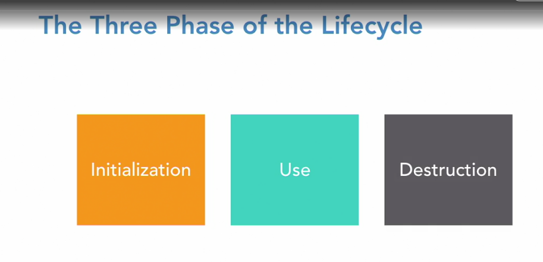
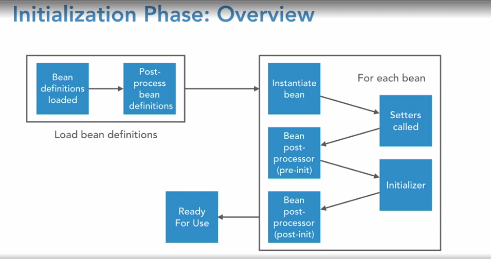

# Spring: Framework in depth
- LinkedIn course : Frank Moley

## Inversion of control

- The container maintains all the classes including dependency classes.
- Container maintain the lifecycle of objects freeing our business logic from these overheads to create, maintain and destroy these objects.
- Object are injected at runtime or at startup.
- Objects that accepts a dependent object usually accepts via a constructor or setter injection.
    - When a object cannot do its responsibility without the dependent object constructor injection is preferred. While an optional or variable concrete implementation of an class can be injected using setters.

## Notes

- Application context is point of contact for our application with spring framework.
- We should try to avoid imports of spring classes in our code with exceptions to annotations and entry point of the application classes
- Application context encapsulates BeanFactory which is the IOC container and creates, holds and injects our bean at required places in our application
- Spring can have more than one application contexts for eg. Web containers
- Parent containers can interact with child.
- Environment variables are passed through property file to our application to behave in a certain way or to mock some condition.
- Profiles are used to create conditional beans or pass some certain value into our applications. spring.profiles.active is the property that can be used to pass this.
- Spring expression language is evaluation option to create beans or components based on specific conditions from env variables or profiles.

### Bean scopes

- The default bean scope is singleton which will create an instance that will be stored in the IOC and reused for all its references.
- There will be one instance of the object per context definition.
- Prototype is scope that creates new instances for every referenced. This objects are not stored in IOC and available for garbage collection once it is out of scope.
- Session scope is similar to prototype one instance is created for every user session and will not be stored in the IOC.
- Request scope creates an instance for very request inside a session this is also not stored in the IOC.

### Proxies

- Everything is proxy in spring
- All our classes are wrapped by some proxy class.
- Proxies are used to add behavior to our class.

## Component Scanning

- Component scan can be used to enable auto scanning.
- Autowire is used to achieve dependency injection
- @PostConstruct and @PreDestroy can be used to do startup and shutdown tasks that we need to perform before the application is ready to use.

## Spring Bean Lifecycle

- 3 Phases lifecycle
    - Initialization - Shortest of all and the most important of all.
    - Use - Middle phase of the actual application phase. 
    - Destruction - Starting to close the application context
- Eager vs Lazy instantiation.
    - By Default all beans are instantiated early.
    - To truly be lazy, there can be nothing that depends on them.
    - Even when we config lazy but the application context reserves the right to ignore that.

